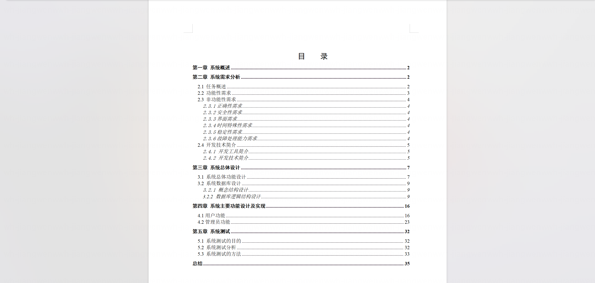
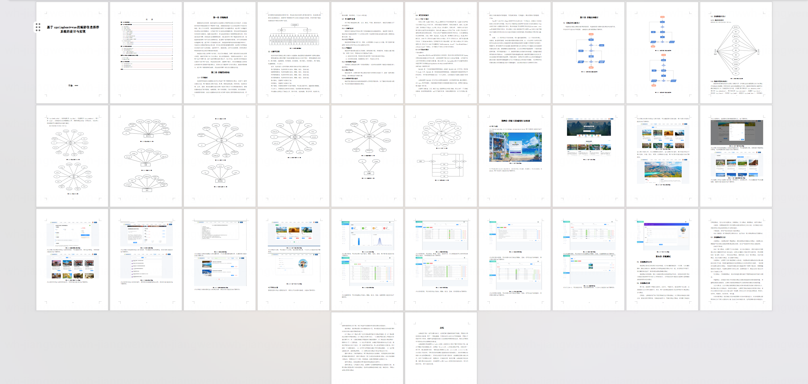
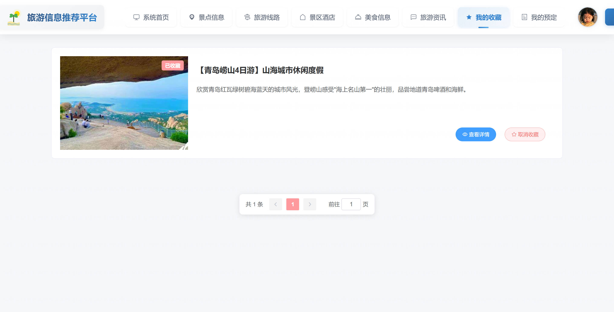
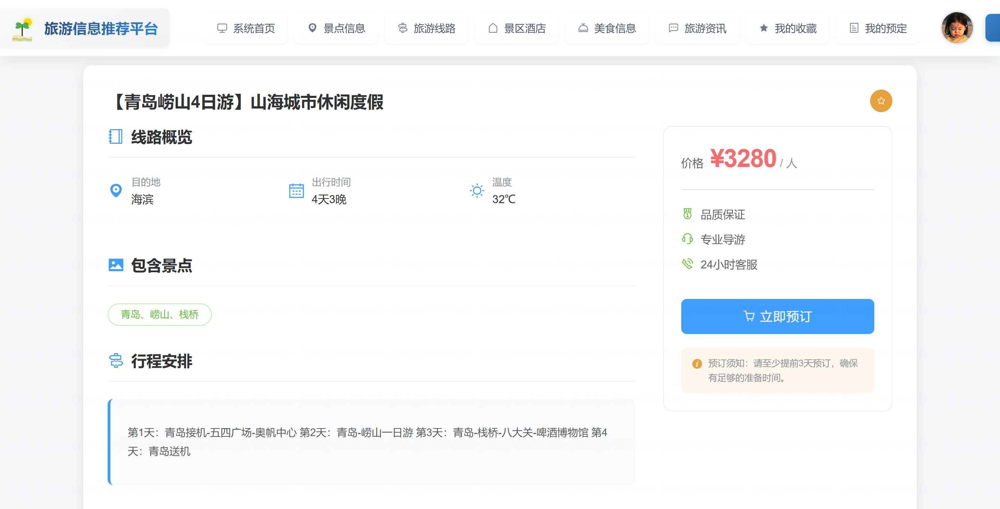
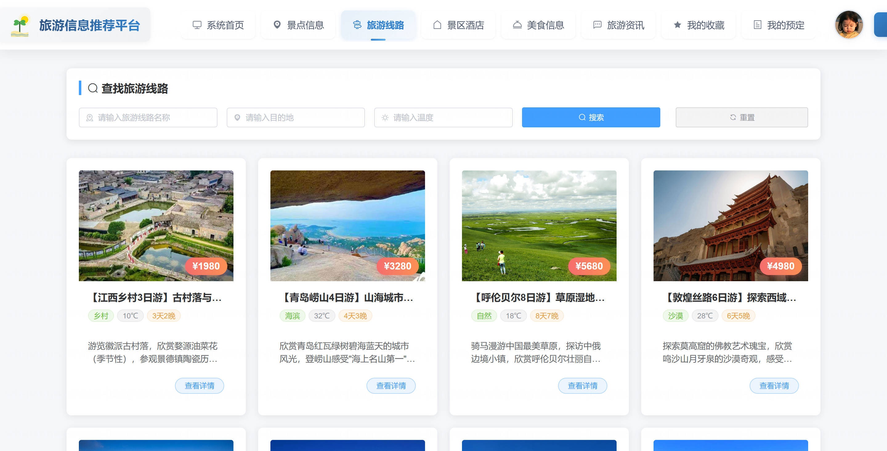
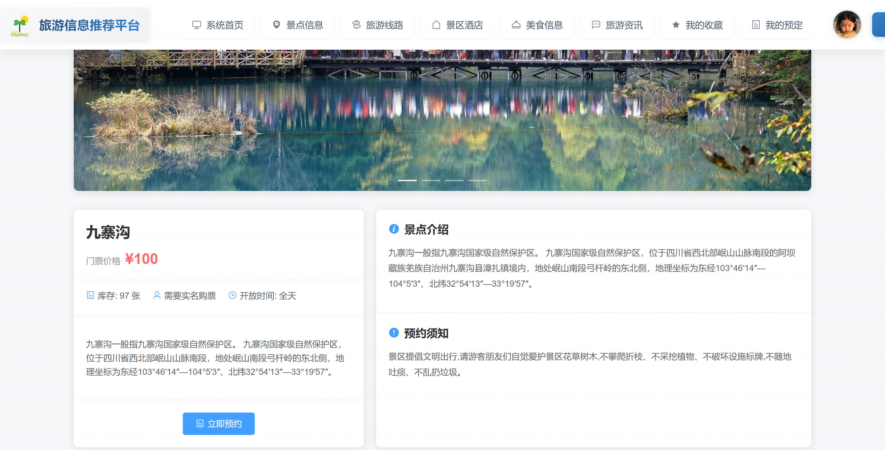
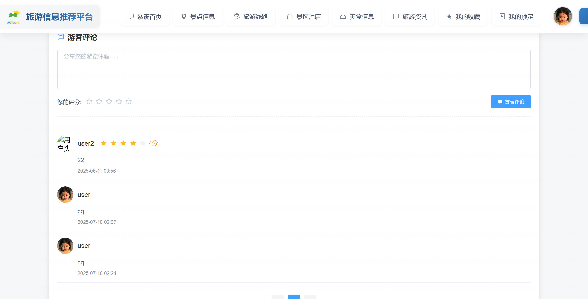
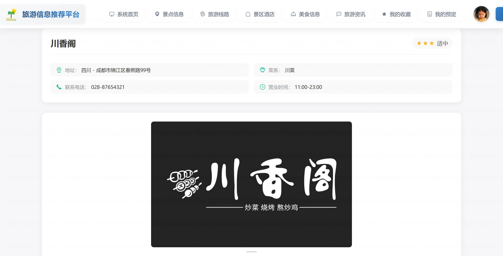

<h1 align="center">基于Spring Boot 的旅游推荐与预订平台系统【带论文】</h1>

- <b>完整代码获取地址：从戎源码网 ([https://armycodes.com/](https://armycodes.com/))</b>
- <b>技术探讨、资料分享，请加QQ群：692619798</b>
- <b>作者微信：19941326836  QQ：3645296857</b>
- <b>承接计算机毕业设计、Java毕业设计、Python毕业设计、深度学习、机器学习</b>
- <b>选题+开题报告+任务书+程序定制+安装调试+论文+答辩ppt 一条龙服务</b>
- <b>所有选题地址 ([https://github.com/Descartes007/allProject](https://github.com/Descartes007/allProject)) </b>

## 一、项目介绍

### 本系统为基于 Spring Boot 的旅游推荐与预订平台，包含后台管理端（管理员）和前端用户端（普通用户）。主要功能如下：
### 管理员（后台管理）
- 基本操作：登录、修改密码、获取/修改个人信息
### 用户管理：用户列表、查看/编辑/删除用户、锁定/解锁、导出/查询
### 景点管理：景点列表/详情、新增/编辑/删除、批量删除、上下架/状态管理
### 线路管理：线路列表/详情、保存/编辑/删除、启用/禁用、线路订单管理
### 酒店管理：酒店列表/详情、房型管理（房型新增/编辑/删除）、酒店订单管理
- 餐厅与菜品管理：餐厅 CRUD、按餐厅获取菜品、菜品 CRUD
- 订单管理：景点预约、酒店预约、线路订单的查询、审核、删除
- 评论/资讯管理：景点评论管理、论坛/资讯 CRUD、评论删除/审核
- 收藏管理：用户收藏查询与删除
### 轮播图管理：轮播图列表/新增/编辑/删除
### 普通用户
- 账号管理：注册、登录、找回密码、修改个人信息、头像上传
- 浏览功能：首页（轮播/推荐）、景点/线路/酒店/美食/论坛列表与详情
- 互动功能：收藏（favor）、评论、查看评论与评分
- 交易功能：提交预约/下单（景点/酒店/线路）、查看订单、取消订单、订单历史
- 个人中心：查看/管理个人信息、订单列表、收藏

## 二、项目技术

- 编程语言：Java（后端）
- 架构：B/S（前后端分离）
- 后端技术：，Spring Boot（Spring）、MyBatis-Plus，MySQL，Redis，JavaMail（邮件发送）、
- 前端技术：Vue 2、Vue Router、Vuex，Element-UI，Axios

## 三、运行环境

- JDK版本：1.8及以上都可以
- 操作系统：Windows7/10、MacOS
- 开发工具：IDEA、Ecplise、MyEclipse都可以

## 四、数据库配置文件

- npm版本：6.14.13及以上都可以
- Redis版本：3.2.100及以上都可以
- 文件名：application.yml和application-dev.yml
- 编码类型：utf8

## 论文截图

## 系统截图

